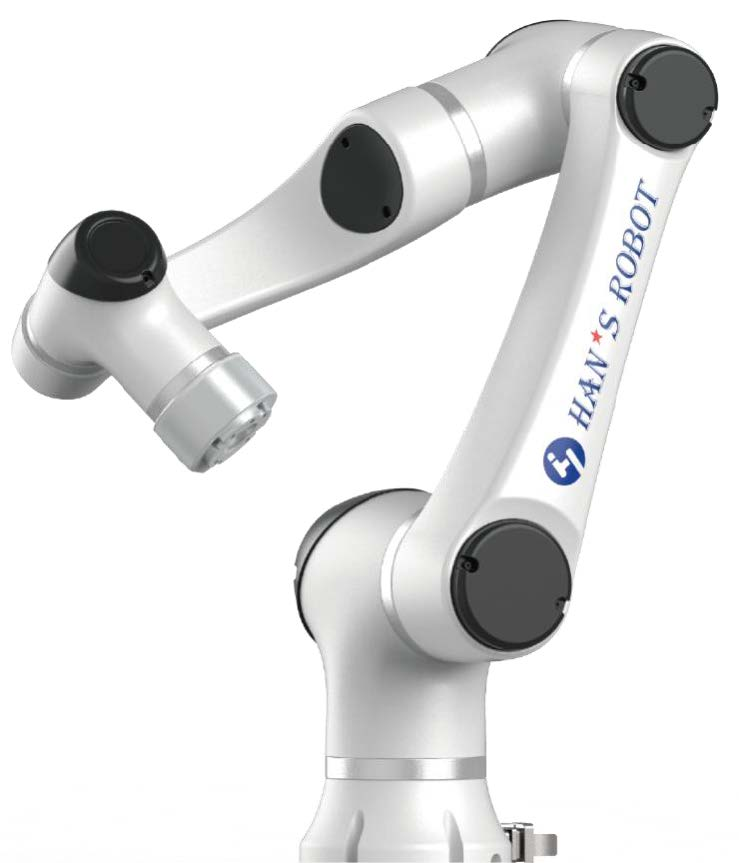
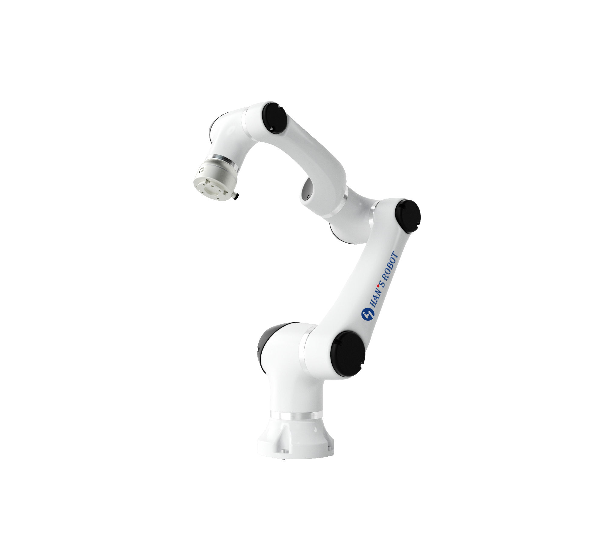

# elfin_model
Store models of all hans-robot,including xacro files for ROS1 and ROS2

## 说明
### 由于机器人模型较多，目前将所有机器人的模型统一放入elfin_model仓库中进行管理，同时会提供对应的xacro文件

目前机器人类型分为两大类：485末端与总线末端

在使用ros控制器真实机器人前，请确定真实机器人的高度与模型中是否一致

在ros功能包中485末端模型统一为旧485末端模型，ethercat末端模型目前只有一种，请确认真实机器人的类型去选择对应的分支下载

如果ros功能包中的模型与真实机器人不一致，请自行到本仓库中下载正确的模型并替换功能包中的模型与xacro文件

---
## 机型分类
### 旧485模型
| 机型   |      末端类型      |  高度(mm) |
|----------|:-------------:|------:|
| E03 |  485末端 | 937.5 |
| E05 |  485末端 | 1175  |
| E05L|  485末端 | 1325  |
| E10 |  485末端 | 1428  |
| E10L|  485末端 | 1728  |
| E15 |  485末端 | 1732.9|

### 新485模型
| 机型   |      末端类型      |  高度(mm) |
|----------|:-------------:|------:|
| E03 |  485末端 | 928.5 |
| E05 |  485末端 | 1166  |
| E05L|  485末端 | 1316  |
| E10 |  485末端 | 1428  |
| E10L|  485末端 | 1728  |
| E15 |  485末端 | 1732.9|

<p align="center">
  
</p>

---
### ethercat模型
| 机型   |      末端类型      |  高度(mm) |
|----------|:-------------:|------:|
| E03 |  总线末端 | 939   |
| E05 |  总线末端 | 1176.5|
| E05L|  总线末端 | 1326.5|
| E10 |  总线末端 | 1433.5|
| E10L|  总线末端 | 1733.5|
| E15 |  总线末端 | 1735.5|

<p align="center">
  
</p>

---
## 替换模型与xacro文件

ROS1:

1. 将elfin_model的model文件夹中对应末端机型的模型文件拷贝至elfin_robot/elfin_description/meshes中进行替换

2. 将elfin_model的urdf文件夹中对应末端机型模型描述文件拷贝至elfin_robot/elfin_description/urdf中进行替换

3. 重新运行ROS1的启动命令即可

ROS2：
1. 将elfin_model的model文件夹中对应末端机型的模型文件拷贝至elfin_robot/elfin_description/meshes中进行替换

2. 将elfin_model的urdf文件夹中对应末端机型模型描述文件拷贝至各机型文件夹中的elfin**_ros2_gazebo/urdf中进行替换
例如：将elfin3的urdf拷贝至elfin3/elfin3_ros2_gazebo/urdf中替换即可

3. 重新编译功能包后运行启动命令即可
```sh
$ colcon build
```